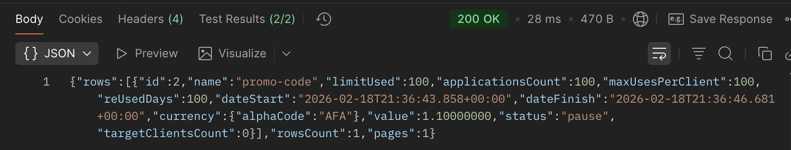
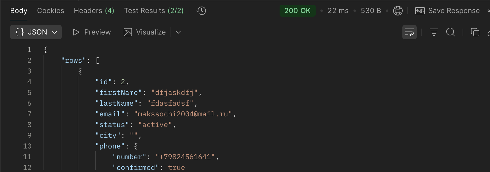
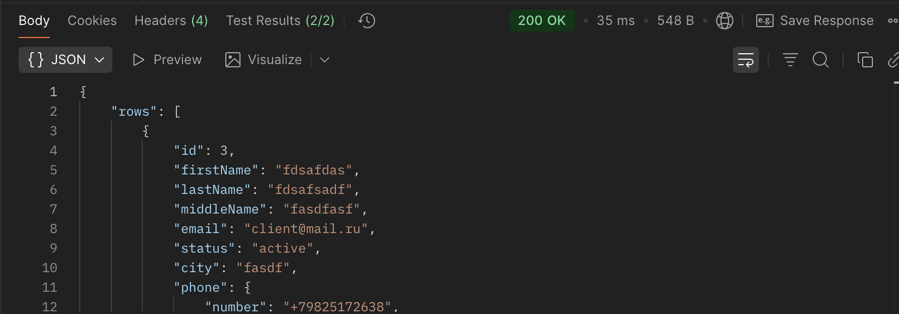
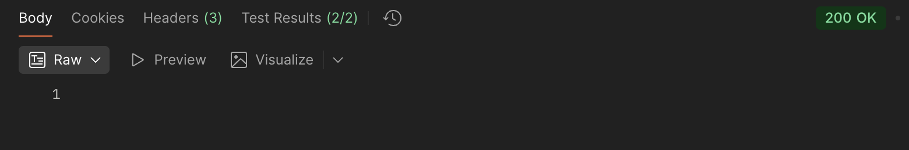
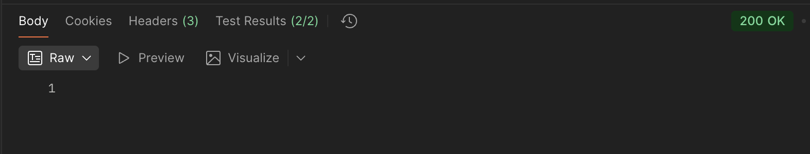
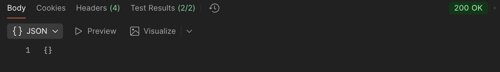
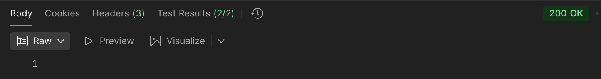
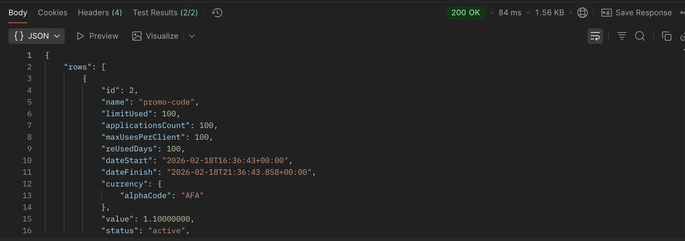

# Лабораторная работа №4

## Тема
Проектирование REST API

## Цель работы
Получить опыт проектирования программного интерфейса.

## Выбранный сервис
Сервис промокодов: `promo-codes`.

Реализация в стиле CQS:
- Query: чтение (`GET`)
- Command: изменение (`POST`, `PUT`, `DELETE`)

Исходные файлы:
- `/Users/maksimtkachenko/Documents/proximo-backend/src/Proximo.Presentation/Controllers/PromoCodeController.cs`
- `/Users/maksimtkachenko/Documents/proximo-backend/src/Proximo.Application/Queries/PromoCode/`
- `/Users/maksimtkachenko/Documents/proximo-backend/src/Proximo.Application/Commands/PromoCode/`

---

## Документация по API

### 1) Принятые проектные решения

1. Разделение чтения и записи по CQS (`Query`/`Command`).
2. Ресурсный REST-роутинг: `/promo-codes`, `/promo-codes/{id}/target-clients`.
3. Единый формат списков: `PaginatedResponse<T>`.
4. Единые параметры пагинации: `page`, `limit`.
5. Единые параметры сортировки/поиска: `order`, `query`.
6. Централизованная обработка ошибок middleware.
7. JSON в `camelCase`, enum в строковом виде (`active`, `pause`, `finish`).
8. Авторизация Bearer JWT обязательна для API.
9. DTO-контракты отделены от доменных сущностей.
10. Повышенная сложность закрыта за счет `PUT` и `DELETE`.

---

### 2) Общие форматы

Базовый URL:
- `http://localhost:5240`

Общие заголовки:
- `Authorization: Bearer <token>`
- `Content-Type: application/json` (для body-запросов)

Формат пагинированного ответа:

```json
{
  "rows": [],
  "rowsCount": 0,
  "pages": 0
}
```

Расшифровка:
- `rows` — массив записей текущей страницы.
- `rowsCount` — общее количество записей по фильтру.
- `pages` — общее число страниц.

Формат ошибки (пример):

```json
{
  "type": "notFoundError",
  "message": "Promo code not found"
}
```

---

### 3) Подробное описание endpoint

### Endpoint 1
`GET /promo-codes`

Назначение:
- Получить список промокодов.

Параметры запроса (Query):
- `page` — номер страницы (1, 2, 3...).
- `limit` — количество записей на страницу.
- `order` — сортировка, пример `id:desc`.
- `query` — общий поисковый текст.
- `id` — фильтр по id промокода.
- `name` — фильтр по названию промокода.
- `currency` — фильтр по валюте (например, `USD`).
- `status` — фильтр по статусу (`active|pause|finish`).
- `value` — фильтр по номиналу промокода.
- `limitUsed` — лимит использований промокода.
- `targetClientsCount` — кол-во привязанных клиентов.
- `dateStartFrom` — дата старта "от".
- `dateFinishTo` — дата окончания "до".

Пример запроса:

```http
GET /promo-codes?page=1&limit=10&order=id:desc&name=LAB4
Authorization: Bearer <token>
```

Формат ответа `200`:

```json
{
  "rows": [
    {
      "id": 101,
      "name": "LAB4_PROMO",
      "limitUsed": 100,
      "applicationsCount": 0,
      "maxUsesPerClient": 1,
      "reUsedDays": 30,
      "dateStart": "2026-02-18T08:00:00+00:00",
      "dateFinish": "2026-12-31T20:59:59+00:00",
      "currency": { "numericCode": 840, "alphaCode": "USD" },
      "value": 10,
      "status": "active",
      "targetClientsCount": 2
    }
  ],
  "rowsCount": 1,
  "pages": 1
}
```

Расшифровка ответа:
- `id` — идентификатор промокода.
- `name` — название/код промокода.
- `limitUsed` — максимально допустимое число применений.
- `applicationsCount` — сколько раз уже применяли.
- `maxUsesPerClient` — сколько раз один клиент может использовать код.
- `reUsedDays` — через сколько дней клиент может использовать снова.
- `dateStart`, `dateFinish` — период действия промокода.
- `currency` — валюта номинала.
- `value` — значение (сумма/бонус).
- `status` — текущий статус (`active`, `pause`, `finish`).
- `targetClientsCount` — число целевых клиентов.

---

### Endpoint 2
`GET /promo-codes/target-clients`

Назначение:
- Получить клиентов, привязанных к промокодам.

Параметры запроса:
- `page`, `limit`, `order`, `query` — стандартные служебные параметры.
- `promoCodeId` — id промокода.
- `id` — id клиента.
- `clientName` — ФИО клиента для поиска.
- `email` — email клиента.
- `status` — статус клиента.
- `city`, `country` — гео-фильтры.
- `ibId`, `ibName`, `ibEmail` — фильтры по IB.

Пример запроса:

```http
GET /promo-codes/target-clients?page=1&limit=10&promoCodeId=101
Authorization: Bearer <token>
```

Ответ `200` (формат):

```json
{
  "rows": [
    {
      "id": 501,
      "firstName": "Ivan",
      "lastName": "Petrov",
      "middleName": "I.",
      "email": "ivan@example.com",
      "status": "active",
      "city": "Moscow",
      "phone": { "code": "+7", "number": "9000000000" },
      "country": { "id": 643, "name": "Russia", "iso2Code": "RU", "iso3Code": "RUS" },
      "usageCount": 0,
      "canBeRemoved": true
    }
  ],
  "rowsCount": 1,
  "pages": 1
}
```

Расшифровка ответа:
- `usageCount` — сколько раз этот клиент использовал промокод.
- `canBeRemoved` — можно ли безопасно удалить клиента из таргета.

---

### Endpoint 3
`GET /promo-codes/{id}/available-target-clients`

Назначение:
- Получить клиентов, которых можно добавить в промокод.

Path-параметры:
- `id` — id промокода.

Query-параметры:
- `page`, `limit`, `order`, `query`, `clientName`, `email`, `status`, `city`, `country`, `ibId`, `ibName`, `ibEmail`.

Пример запроса:

```http
GET /promo-codes/101/available-target-clients?page=1&limit=10&query=ivan
Authorization: Bearer <token>
```

Формат ответа:
- такой же, как Endpoint 2 (`PaginatedResponse<PromoCodeTargetClientDto>`).

---

### Endpoint 4
`POST /promo-codes`

Назначение:
- Создать новый промокод.

Body JSON:
- `name` — имя промокода.
- `currencyNumericCode` — числовой код валюты (например `840` для USD).
- `value` — значение промокода.
- `limitUsed` — общий лимит применений.
- `maxUsesPerClient` — лимит применений на одного клиента.
- `reUsedDays` — через сколько дней разрешено повторное применение.
- `status` — стартовый статус (`active|pause|finish`).
- `dateStart` — дата начала действия.
- `dateFinish` — дата окончания действия.
- `targetClientIds` — список id клиентов, кому сразу доступен промокод.

Пример:

```json
{
  "name": "LAB4_PROMO_NEW",
  "currencyNumericCode": 840,
  "value": 15,
  "limitUsed": 100,
  "maxUsesPerClient": 1,
  "reUsedDays": 30,
  "status": "active",
  "dateStart": "2026-02-18T08:00:00+00:00",
  "dateFinish": "2026-12-31T20:59:59+00:00",
  "targetClientIds": [501, 502]
}
```

Ответы:
- `200 OK` — промокод создан.
- `400 Bad Request` — например, имя уже занято.

---

### Endpoint 5
`POST /promo-codes/{id}/target-clients`

Назначение:
- Добавить клиентов в таргет промокода.

Path:
- `id` — id промокода.

Body:
- `clientIds` — массив id клиентов для добавления.

Пример:

```json
{
  "clientIds": [503, 504]
}
```

Ответы:
- `200 OK`.
- `404 Not Found` — промокод не найден.

---

### Endpoint 6
`PUT /promo-codes/{id}`

Назначение:
- Обновить существующий промокод.

Path:
- `id` — id промокода.

Body:
- `limitUsed` — новый общий лимит.
- `dateStart` — новая дата старта.
- `dateFinish` — новая дата окончания.
- `status` — новый статус (`active|pause|finish`).

Пример:

```json
{
  "limitUsed": 150,
  "dateStart": "2026-02-18T08:00:00+00:00",
  "dateFinish": "2027-01-31T20:59:59+00:00",
  "status": "pause"
}
```

Ответы:
- `200 OK`.
- `404 Not Found`.

---

### Endpoint 7
`DELETE /promo-codes/{id}/target-clients`

Назначение:
- Удалить клиентов из таргета промокода.

Path:
- `id` — id промокода.

Body:
- `clientIds` — массив id клиентов для удаления.

Пример:

```json
{
  "clientIds": [503]
}
```

Ответы:
- `200 OK`.
- `404 Not Found`.

---

### Endpoint 8
`GET /promo-codes?status=active`

Назначение:
- Получить только активные промокоды (отдельный GET-сценарий фильтрации).

Параметры запроса:
- `page` — номер страницы.
- `limit` — размер страницы.
- `status=active` — вернуть только активные промокоды.
- `order=name:asc` — сортировка по имени по возрастанию.

Пример запроса:

```http
GET /promo-codes?page=1&limit=10&status=active&order=name:asc
Authorization: Bearer <token>
```

Формат ответа:
- `PaginatedResponse<PromoCodeDto>` (как в Endpoint 1).
- В `rows[*].status` ожидается значение `active`.

---

## Тестирование API в Postman

### 1) `GET /promo-codes`

```javascript
pm.test("Статус 200 OK", function () {
    pm.response.to.have.status(200);
});

pm.test("В ответе есть массив rows", function () {
    var jsonData = pm.response.json();
    pm.expect(jsonData.rows).to.be.an("array");
});
```


### 2) `GET /promo-codes/target-clients`

```javascript
pm.test("Статус 200 OK", function () {
    pm.response.to.have.status(200);
});

pm.test("Ответ содержит массив rows", function () {
    var jsonData = pm.response.json();
    pm.expect(jsonData.rows).to.be.an("array");
});
```


### 3) `GET /promo-codes/{id}/available-target-clients`

```javascript
pm.test("Статус 200 OK", function () {
    pm.response.to.have.status(200);
});

pm.test("Ответ содержит массив rows", function () {
    var jsonData = pm.response.json();
    pm.expect(jsonData.rows).to.be.an("array");
});
```


### 4) `POST /promo-codes`

```javascript
pm.test("Статус 200 OK", function () {
    pm.response.to.have.status(200);
});

pm.test("Код ответа меньше 400", function () {
    pm.expect(pm.response.code).to.be.below(400);
});
```


### 5) `POST /promo-codes/{id}/target-clients`

```javascript
pm.test("Статус 200 OK", function () {
    pm.response.to.have.status(200);
});

pm.test("Код ответа меньше 400", function () {
    pm.expect(pm.response.code).to.be.below(400);
});
```

### 6) `PUT /promo-codes/{id}`

```javascript
pm.test("Статус 200 OK", function () {
    pm.response.to.have.status(200);
});

pm.test("Код ответа меньше 400", function () {
    pm.expect(pm.response.code).to.be.below(400);
});
```


### 7) `DELETE /promo-codes/{id}/target-clients`

```javascript
pm.test("Статус 200 OK", function () {
    pm.response.to.have.status(200);
});

pm.test("Код ответа меньше 400", function () {
    pm.expect(pm.response.code).to.be.below(400);
});
```


### 8) `GET /promo-codes?status=active`

```javascript
pm.test("Статус 200 OK", function () {
    pm.response.to.have.status(200);
});

pm.test("Все записи имеют статус active", function () {
    var jsonData = pm.response.json();
    pm.expect(jsonData.rows).to.be.an("array");
    jsonData.rows.forEach(function (item) {
        pm.expect(item.status).to.eql("active");
    });
});
```

